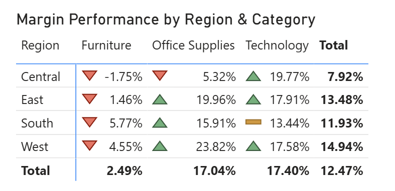
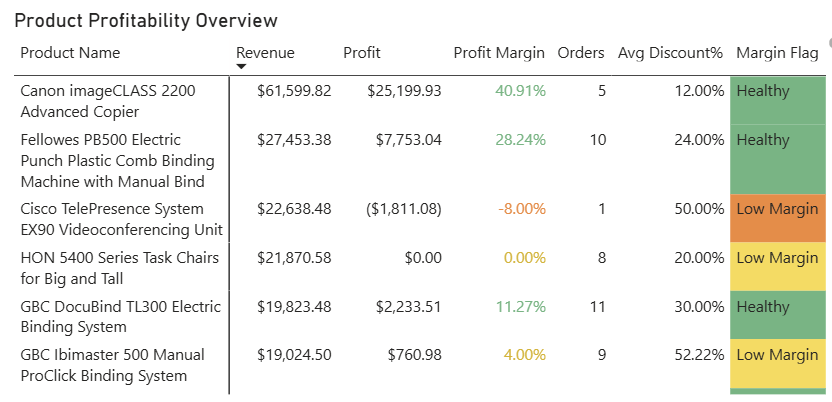

#  Retail Sales Performance Analysis

# Client Background

## Business Context

The retail company operates across multiple regions within the United States, offering products across three primary categories: **Furniture, Office Supplies, and Technology**. As transaction volumes increased over time, management required greater visibility into overall business performance to support strategic decision-making.

Despite continued sales growth, leadership lacked a centralized reporting solution capable of monitoring revenue trends, profitability, customer purchasing behavior, regional performance, and pricing effectiveness. Without integrated reporting, identifying profit leakage, evaluating discount strategies, and prioritizing high-performing products became increasingly difficult.

To address these challenges, an interactive Power BI dashboard was developed to transform historical retail transaction data into actionable business insights, enabling stakeholders to monitor key performance indicators, identify growth opportunities, and make evidence-based decisions.

---

# Business Objectives

The project was designed to answer critical business questions that support executive decision-making and improve operational performance.

- Evaluate overall business performance using Revenue, Profit, Orders, Profit Margin, and Average Order Value.
- Analyze historical sales trends to identify growth patterns and seasonal demand.
- Measure profitability across product categories, customer segments, and geographic regions.
- Assess the effectiveness of pricing and discount strategies.
- Identify high-performing and underperforming products requiring strategic attention.
- Deliver an interactive executive reporting solution for business stakeholders.

---

# Primary Stakeholders

| Stakeholder | Business Objective |
|-------------|--------------------|
| Executive Leadership | Monitor overall business health and long-term growth. |
| Sales Director | Evaluate revenue performance and sales trends. |
| Product Managers | Identify high-performing and low-performing product categories. |
| Regional Managers | Compare profitability across regions and states. |
| Pricing Team | Assess whether discount strategies improve or reduce profitability. |
| Marketing Team | Identify customer segments and products for targeted campaigns. |

---

# Business Questions

This report was designed to answer the following strategic business questions.

### Executive Management

- Is the business growing sustainably?
- Is profit increasing alongside revenue?
- Which KPIs require immediate attention?

### Sales Leadership

- Which months generate the highest revenue?
- Are customers purchasing more frequently?
- Is revenue growth driven by larger purchases or increased order volume?

### Product Management

- Which product categories generate the highest profit?
- Which products require pricing review?
- Which categories should receive additional investment?

### Regional Operations

- Which regions consistently outperform others?
- Which states contribute the largest share of revenue?
- Where is profitability being lost?

### Pricing & Marketing

- Are discounts improving sales profitability?
- Which products receive excessive discounts?
- Which customer segments generate the highest returns?

---

# Executive Summary

Over the four-year reporting period (2014–2017), the business generated **$2.30M in revenue** from **5,009 customer orders**, producing **$286.4K in profit** while maintaining an overall **12.47% profit margin**. Revenue increased by **46.9%**, supported primarily by a **50.8% increase in order volume**, demonstrating strong customer acquisition and business expansion. However, declining Average Order Value suggests customers are placing more frequent but lower-value orders. Technology remained the strongest-performing product category, while Furniture consistently underperformed in profitability. Regional analysis further revealed significant differences in operational efficiency, with the West region delivering the highest margins and the Central region requiring immediate attention.

---

# Executive KPI Summary

| KPI | Performance | Business Interpretation |
|------|------------:|-------------------------|
| Revenue | **$2.30M** | Strong business growth supported by higher customer demand. |
| Orders | **5,009** | Transaction volume increased significantly year-over-year. |
| Profit | **$286.4K** | Revenue growth translated into improved profitability. |
| Profit Margin | **12.47%** | Margins remained stable despite rapid expansion. |
| Average Order Value | **$458.61** | Slight decline indicates smaller average basket sizes. |
| Discounts | **14% of Revenue** | Promotions supported growth but require ongoing profitability monitoring. |

---

# Executive Highlights

##  Revenue Growth Driven by Higher Customer Demand

Revenue increased by **46.9%** while customer orders grew by **50.8%**, indicating that business expansion was primarily driven by increasing transaction volume rather than higher customer spending. This demonstrates successful customer acquisition but also highlights an opportunity to increase revenue through larger basket sizes. 

---

##  Technology Remains the Primary Profit Driver

Technology generated approximately **$145.5K in profit**, substantially outperforming Furniture and Office Supplies. Consistently strong margins across all customer segments position Technology as the company's most valuable product category for future investment.

---

##  Furniture Continues to Underperform

Despite generating significant revenue, Furniture contributed only **$18.45K profit**, making it the weakest-performing category. High shipping costs, aggressive discounting, and low product margins are likely contributing factors requiring further operational review.

---

##  Regional Performance Varies Significantly

The West region achieved the highest overall profit margin (**14.94%**), while the Central region produced only **7.92%**, with negative Furniture margins observed in several areas. Replicating successful pricing and product strategies from the West could improve profitability across weaker regions. 

---

# Dataset Overview

| Attribute | Description |
|-----------|-------------|
| Dataset | Sample Superstore |
| Reporting Period | 2014 – 2017 |
| Business Domain | Retail |
| Analysis Type | Sales & Profitability Analysis |
| Categories | Furniture, Office Supplies, Technology |
| Customer Segments | Consumer, Corporate, Home Office |
| Geographic Coverage | United States |

---

# Data Preparation

Before analysis, the dataset was prepared using **Power Query** to ensure accuracy, consistency, and reporting readiness.

### Data Preparation Activities

- Verified data types across all fields.
- Created a dedicated Date table for time intelligence.
- Standardized product and geographic attributes.
- Optimized the dataset for analytical reporting.
- Structured the model using a star schema to improve performance and scalability.

The resulting dataset provided a reliable foundation for business reporting and interactive dashboard development.

---

## Data Model

  

The report is built around a central Sales fact table with a dedicated Date table for time intelligence. Two disconnected parameter tables (Metrics and Performance Scope) enable dynamic KPI and performance selection, resulting in a flexible and maintainable reporting model.

---

**Next Section:** Retail Performance Overview

# Retail Performance Overview

  

## Dashboard Purpose

The **Retail Performance Overview** dashboard provides executives with a centralized view of overall business performance by monitoring revenue, profitability, customer demand, and regional performance. It consolidates key performance indicators with historical sales trends, geographic analysis, and category profitability to help stakeholders quickly assess business health and identify areas requiring deeper investigation.

---

# Stakeholder Questions

This dashboard answers the following business questions:

### Executive Leadership

- Is the business growing sustainably?
- Is profitability improving alongside revenue?
- Which KPIs require immediate attention?

### Sales Management

- Which months generate the strongest sales?
- Is customer demand increasing?
- Is revenue growth driven by higher spending or more transactions?

### Regional Management

- Which states generate the highest revenue?
- Which regions are most profitable?
- Where should operational improvements be prioritized?

### Category Management

- Which product categories contribute the most profit?
- Which categories require strategic intervention?

---

# KPI Performance Summary

| KPI | Value | Business Interpretation |
|------|------:|-------------------------|
| Revenue | **$2.30M** | Strong business expansion supported by increasing customer demand. |
| Orders | **5,009** | Transaction volume increased substantially. |
| Profit | **$286.4K** | Revenue growth translated into higher profitability. |
| Profit Margin | **12.47%** | Margins remained stable despite rapid business growth. |
| Average Order Value | **$458.61** | Customers spent slightly less per transaction. |

---

# Key Business Findings

---

## 1. Revenue Growth is Primarily Driven by Customer Demand

### Business Question

Is business growth being driven by stronger customer spending or increased purchasing activity?

### Evidence

- Revenue reached **$2.30M**.
- Revenue increased **46.9%** year-over-year.
- Orders increased **50.8%**.
- Average Order Value declined **2.6%**.

### Insight

The business achieved exceptional revenue growth during the reporting period. However, customer orders increased at a faster rate than Average Order Value, indicating that growth was driven primarily by increased purchasing activity rather than higher customer spending per transaction.

### Business Impact

The current growth strategy has successfully expanded customer demand and transaction volume. However, continued dependence on higher order volume may limit future revenue growth unless average basket size also improves.

### Recommendation

Introduce product bundles, cross-selling campaigns, premium product recommendations, and free-shipping thresholds to increase Average Order Value while maintaining strong customer acquisition.

---

## 2. Technology Continues to Drive Company Profitability

### Business Question

Which product category contributes the greatest share of company profit?

### Supporting Visual

  

### Evidence

| Category | Profit |
|----------|--------:|
| Technology | **$145.45K** |
| Office Supplies | **$122.49K** |
| Furniture | **$18.45K** |

### Insight

Technology generated the highest overall profit, substantially outperforming both Office Supplies and Furniture. The category consistently maintained strong profitability throughout the reporting period, making it the company's strongest financial contributor.

### Business Impact

Technology products represent the highest-return investment within the portfolio and should remain a strategic priority for inventory allocation, marketing investment, and cross-selling initiatives.

### Recommendation

Increase inventory availability, promote premium technology products, and prioritize marketing investment toward high-margin technology offerings.

---

## 3. Furniture Generates Revenue but Delivers Minimal Profit

### Business Question

Which category requires immediate operational improvement?

### Evidence

- Revenue remains significant.
- Profit totals only **$18.45K**.
- Category margin remains substantially below other categories.

### Insight

Although Furniture contributes meaningful sales revenue, profitability remains extremely weak. This suggests that revenue growth within this category is not translating into sustainable earnings.

### Business Impact

Potential causes include aggressive discounting, higher shipping expenses, lower product margins, or inefficient pricing strategies. Without intervention, Furniture will continue to reduce overall business profitability.

### Recommendation

Review supplier contracts, optimize logistics costs, reassess pricing strategy, and evaluate low-margin products for portfolio optimization.

---

## 4. Regional Profitability Differs Significantly Across the Business

### Business Question

Which regions operate most efficiently?

### Supporting Visual

  

### Evidence

| Region | Profit Margin |
|---------|--------------:|
| West | **14.94%** |
| East | **13.48%** |
| South | **11.93%** |
| Central | **7.92%** |

### Insight

The West region consistently delivers the strongest profitability, while the Central region significantly underperforms across multiple product categories.

### Business Impact

Regional differences suggest variations in pricing effectiveness, operational efficiency, product mix, or distribution costs.

### Recommendation

Benchmark successful pricing strategies and product mix from the West region and replicate best practices across lower-performing markets.

---

## 5. California Represents the Company's Largest Revenue Market

### Business Question

Which geographic markets generate the highest sales?

### Supporting Visual

  

### Evidence

Top revenue-generating states include:

- California
- New York
- Texas
- Washington
- Pennsylvania

California generated approximately **$457.7K** in revenue.

### Insight

Revenue is concentrated within a relatively small number of high-performing states, with California serving as the company's largest individual market.

### Business Impact

These markets present significant opportunities for premium product launches, targeted promotions, and customer retention initiatives.

### Recommendation

Increase marketing investment within high-performing regions while identifying opportunities to replicate successful sales strategies in emerging markets.

---

## 6. Revenue and Profit Exhibit Seasonal Demand Patterns

### Business Question

Does customer demand vary throughout the year?

### Supporting Visual

  

### Evidence

Revenue and profit display recurring monthly peaks and temporary slowdowns throughout the reporting period.

### Insight

Seasonal purchasing behavior significantly influences sales performance, with recurring high-demand periods generating stronger revenue and profitability.

### Business Impact

Understanding seasonality allows the business to improve inventory planning, staffing, promotional timing, and supply chain efficiency.

### Recommendation

Align inventory planning, marketing campaigns, and staffing levels with historical seasonal demand patterns to maximize sales opportunities.

---

# Dashboard Summary

The Retail Performance Overview dashboard demonstrates that the business achieved substantial revenue and profit growth while maintaining stable profitability. Growth was driven primarily by increased customer demand rather than higher spending per transaction. Technology emerged as the strongest-performing category, whereas Furniture remained a structural profitability challenge. Geographic analysis identified California as the largest revenue contributor and the West region as the most profitable operating area, providing valuable benchmarks for future business expansion and operational improvement.

---

# Supporting Visual Gallery

| Visual | Business Purpose |
|---------|------------------|
| Revenue KPI | Executive performance monitoring |
| Revenue Trend | Historical growth analysis |
| Category Profit | Product portfolio evaluation |
| Revenue Map | Geographic performance analysis |
| Regional Margin Matrix | Regional profitability comparison |
| Executive Insight Card | Automated business summary |

# Sales Performance Deep Dive

  

## Dashboard Purpose

The **Sales Performance Deep Dive** dashboard evaluates product-level performance by analyzing customer segments, discount strategies, product profitability, and revenue concentration. Unlike the executive overview, this dashboard focuses on identifying the underlying business drivers influencing revenue quality, profitability, and pricing effectiveness.

The analysis enables stakeholders to move beyond "how much was sold" and understand **which products, customers, and pricing decisions generate sustainable profit**.

---

# Stakeholder Questions

### Executive Leadership

- Is promotional spending improving profitability?
- Which products generate the greatest business value?

### Product Managers

- Which products deserve additional investment?
- Which products should be reviewed or discontinued?

### Pricing Team

- Are discounts helping or hurting profitability?
- Which products receive excessive discounts?

### Marketing Team

- Which customer segment contributes the most revenue?
- Which products should receive additional marketing support?

### Supply Chain

- Which products require inventory prioritization?

---

# Dashboard Overview

| Analysis Area | Business Objective |
|--------------|--------------------|
| Customer Segments | Identify highest-value customer groups |
| Product Categories | Compare category profitability |
| Pareto Analysis | Identify products driving most revenue |
| Product Profitability | Detect high-performing and loss-making products |
| Discount Analysis | Evaluate pricing effectiveness |

---

# Key Business Findings

---

## 1. Promotional Discounts Represent a Significant Business Investment

### Business Question

How much revenue is being invested in promotional discounts?

### Supporting Visual

  

### Evidence

- Total Discounts: **$322.58K**
- Equivalent to **14% of total revenue**

### Insight

The business invested more than **$322K** in promotional discounts during the reporting period. Although promotional activity likely supported customer acquisition and sales growth, discounts now represent a significant business investment that should be continuously evaluated against profitability.

### Business Impact

Promotions successfully stimulate demand, but excessive discounting can reduce margins if incremental revenue does not offset lost profit.

### Recommendation

Introduce discount effectiveness reporting by measuring revenue growth, incremental profit, and return on promotional investment before approving future campaigns.

---

## 2. Consumer Customers Generate the Largest Revenue Opportunity

### Business Question

Which customer segment contributes the greatest share of revenue?

### Supporting Visual

  

### Evidence

| Segment | Business Observation |
|---------|----------------------|
| Consumer | Largest revenue contributor |
| Corporate | Second-largest contributor |
| Home Office | Smallest contributor |

Within the Consumer segment:

- Technology Revenue: **~$406K**
- Furniture Revenue: **~$391K**

### Insight

Consumer customers generate the largest share of company revenue. However, profitability varies significantly between product categories, with Technology delivering substantially stronger margins than Furniture.

### Business Impact

The Consumer segment remains the company's largest growth opportunity, but category-level profitability should guide future marketing investment rather than revenue alone.

### Recommendation

Increase Technology-focused campaigns while reassessing promotional strategies for low-margin Furniture products.

---

## 3. Technology Delivers Consistently Strong Profitability

### Business Question

Which product category consistently generates the highest financial return?

### Supporting Visual

# Retail Performance Overview

  

### Evidence

| Category | Revenue | Profit | Margin |
|----------|---------:|-------:|-------:|
| Technology | **$836K** | **$145K** | **17.40%** |
| Office Supplies | **$719K** | **$122K** | **17.04%** |
| Furniture | **$742K** | **$18K** | **2.49%** |

### Insight

Technology consistently outperformed every other category across all customer segments, combining strong revenue generation with healthy margins. Unlike Furniture, profitability remained stable throughout the reporting period.

### Business Impact

Technology represents the company's strongest strategic growth category and should remain the primary focus for investment, inventory planning, and premium product offerings.

### Recommendation

Expand Technology inventory, strengthen supplier relationships, and prioritize cross-selling opportunities for high-margin products.

---

## 4. Furniture Generates Revenue but Destroys Profitability

### Business Question

Which category presents the greatest profitability challenge?

### Evidence

Overall Performance

- Revenue: **$742K**
- Profit: **$18K**
- Margin: **2.49%**

Consumer Furniture

- Revenue: **$391K**
- Margin: **1.79%**

### Insight

Furniture generates substantial revenue but contributes only a small fraction of company profit. The category consistently records the weakest margins across all customer segments, indicating structural profitability issues rather than temporary fluctuations.

### Business Impact

Revenue alone is masking poor financial performance. Continued emphasis on Furniture sales without improving margins will reduce overall business profitability.

### Recommendation

Review supplier contracts, optimize logistics costs, reduce unnecessary discounting, and evaluate low-performing SKUs for portfolio rationalization.

---

## 5. Revenue is Highly Concentrated Among a Small Number of Products

### Business Question

Which products drive the majority of business revenue?

### Supporting Visual

  

### Evidence

The highest-performing product generated approximately **$61.6K** in revenue, followed by a sharp decline across remaining products.

### Insight

A relatively small number of products generate a disproportionate share of total revenue, reflecting a classic Pareto (80/20) distribution.

### Business Impact

Revenue concentration increases operational risk if top-performing products experience supply shortages or declining demand.

### Recommendation

Prioritize inventory availability, supplier relationships, and marketing investment for high-performing products while expanding the portfolio of profitable alternatives.

---

## 6. Aggressive Discounting Reduces Profitability

### Business Question

Do higher discounts improve business performance?

### Supporting Visual

  

### Evidence

Products receiving discounts above **20–40%** frequently report significantly lower or negative profit margins.

### Insight

The relationship between discounting and profitability is predominantly negative. While some discounted products remain profitable, aggressive price reductions consistently increase the likelihood of low or negative margins.

### Business Impact

Blanket discount strategies reduce overall business profitability and should be replaced by more targeted pricing policies.

### Recommendation

Implement margin protection rules, customer-specific pricing strategies, and approval workflows for high-value discounts.

---

## 7. Several High-Revenue Products Continue to Destroy Value

### Business Question

Which products require immediate pricing review?

### Supporting Visual

  

### Evidence

Loss-making examples include:

- Cisco TelePresence System
- Cubify CubeX 3D Printer
- Lexmark Laser Printer
- Martin Yale Letter Opener

These products generated sales but produced negative profit margins.

### Insight

Revenue generation alone does not indicate business success. Several products consistently destroy shareholder value despite respectable sales performance.

### Business Impact

Continuing to promote loss-making products reduces portfolio profitability and consumes operational resources.

### Recommendation

Conduct detailed pricing, procurement, and demand analysis before continuing investment in persistently unprofitable products.

---

# Dashboard Summary

The Sales Performance Deep Dive reveals that sustained business growth depends on **revenue quality rather than revenue volume alone**. Technology consistently generates strong profitability, while Furniture remains constrained by structurally weak margins. Customer demand is well diversified across market segments, reducing concentration risk; however, product-level revenue remains heavily dependent on a relatively small number of high-performing products. The analysis also demonstrates that aggressive discounting frequently erodes profitability, highlighting the importance of targeted pricing strategies and margin-focused decision-making. Together, these findings provide a clear roadmap for improving long-term profitability through optimized product investment, smarter discount governance, and a more balanced product portfolio.

---

# Supporting Visual Gallery

| Visual | Business Purpose |
|---------|------------------|
| Discount KPI | Promotional investment |
| Customer Segment Treemap | Revenue by customer segment |
| Category Margin | Category profitability |
| Pareto Chart | Revenue concentration |
| Discount vs Profit Scatter | Pricing effectiveness |
| Product Profitability Table | Product-level decision support |
| Smart Tooltip | Detailed product insights |

# Executive Recommendations

The analysis identified several opportunities to improve long-term profitability, optimize operational efficiency, and support sustainable business growth. The following recommendations are directly supported by the findings presented throughout the report.

---

##  Increase Average Order Value

### Business Problem

Although revenue increased by **46.9%**, Average Order Value (AOV) declined by **2.6%**, indicating that growth is primarily driven by higher order volume rather than increased customer spending.

### Recommendations

- Introduce product bundles to increase basket size.
- Implement cross-selling and upselling strategies for complementary products.
- Introduce free shipping thresholds to encourage higher-value purchases.
- Recommend premium product alternatives during checkout.
- Develop customer loyalty programs that reward larger purchases.

**Expected Business Outcome**

- Higher revenue without relying solely on customer acquisition.
- Improved customer lifetime value.
- Sustainable long-term revenue growth.

---

##  Expand High-Profit Technology Products

### Business Problem

Technology generated approximately **$145K profit**, making it the company's strongest-performing category.

### Recommendations

- Increase inventory availability for high-demand technology products.
- Allocate greater marketing investment toward premium technology offerings.
- Strengthen supplier relationships for top-performing SKUs.
- Expand cross-selling opportunities within the Technology category.

**Expected Business Outcome**

- Higher overall profitability.
- Increased return on marketing investment.
- Improved product portfolio performance.

---

##  Improve Furniture Profitability

### Business Problem

Furniture generated substantial revenue but produced only **$18K profit**, making it the weakest-performing category.

### Recommendations

- Review pricing strategies for low-margin products.
- Reduce excessive discounting.
- Optimize shipping and logistics costs.
- Reassess low-performing SKUs.
- Negotiate improved supplier pricing.

**Expected Business Outcome**

- Improved category margins.
- Reduced profit leakage.
- Stronger overall portfolio profitability.

---

##  Replicate High-Performing Regional Strategies

### Business Problem

The West region consistently outperformed every other region, while Central recorded the lowest margins.

### Recommendations

- Benchmark pricing strategies used in the West region.
- Review operational processes in Central.
- Compare product mix between regions.
- Optimize inventory allocation based on regional demand.

**Expected Business Outcome**

- More consistent profitability across all regions.
- Reduced operational inefficiencies.
- Improved regional performance.

---

##  Implement Smarter Discount Policies

### Business Problem

The analysis demonstrates that higher discounts frequently correspond with lower profit margins.

### Recommendations

- Replace blanket promotions with targeted discounts.
- Introduce approval workflows for high-value discounts.
- Establish minimum margin thresholds before discounts are approved.
- Develop customer-specific promotional strategies.

**Expected Business Outcome**

- Improved pricing effectiveness.
- Higher profit margins.
- Better return on promotional spending.

---

##  Prioritize High-Performing Products

### Business Problem

Pareto analysis shows that a relatively small number of products generate a disproportionately large share of revenue.

### Recommendations

- Prevent stock-outs for top-performing products.
- Improve sales forecasting.
- Prioritize supplier relationships for key products.
- Allocate marketing resources toward proven performers.

**Expected Business Outcome**

- Increased revenue stability.
- Improved inventory efficiency.
- Reduced operational risk.

---

# Technical Highlights

This project demonstrates both technical implementation and business analysis skills through the development of an interactive Power BI reporting solution.

### Data Preparation

- Data cleaning using Power Query
- Data validation
- Data transformation
- Data type optimization

### DAX Development

The report includes more than **60 custom DAX measures**, including:

- Revenue KPIs
- Profitability metrics
- Time Intelligence calculations
- Dynamic KPI switching
- Ranking measures
- Executive Insight generation
- Conditional formatting measures
- Regional profitability calculations

### Dashboard Features

- Interactive slicers
- Dynamic KPI cards
- Drill-through navigation
- Custom tooltips
- Bookmark navigation
- Smart Executive Insights
- Dynamic visual interactions
- Geographic analysis

---

# Project Outcomes

This project transformed raw retail transaction data into an interactive business intelligence solution capable of supporting executive decision-making.

The analysis identified:

- Strong business growth driven by increasing customer demand.
- Technology as the highest-profit product category.
- Persistent profitability challenges within Furniture.
- Significant regional performance differences.
- Revenue concentration among a limited number of high-performing products.
- Opportunities to improve pricing strategy through more targeted discount policies.

The recommendations presented throughout this report provide a practical roadmap for increasing profitability, optimizing pricing decisions, strengthening regional performance, and supporting long-term business growth.

---

# Contact

If you have feedback, suggestions, or would like to discuss this project, feel free to connect with me.

**LinkedIn:** *https://www.linkedin.com/in/ritch-rai-4b8b23269/*

**GitHub:** *https://github.com/ritchiraii*

---
⭐ If you found this project helpful or interesting, consider giving the repository a **Star**!
